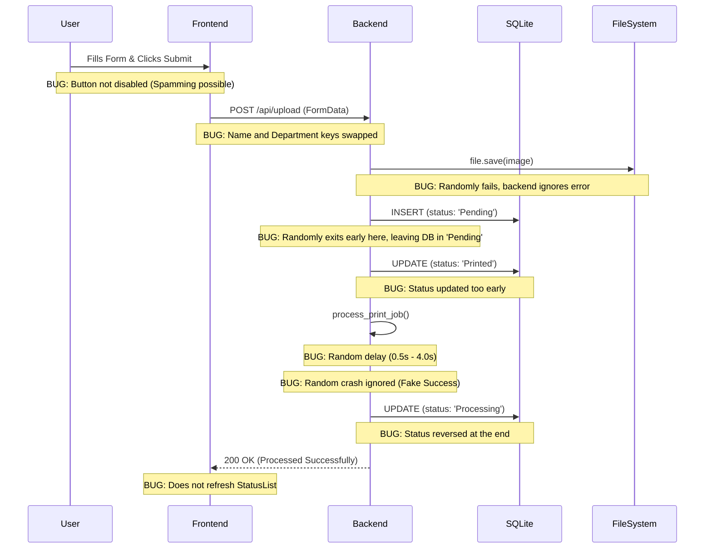

# Level 1 Architecture Diagram (100% Visibility)

## Core Components
1. **Frontend**: React SPA
2. **Backend**: Monolithic Flask API
3. **Database**: SQLite
4. **Storage**: Local File System

## Request Lifecycle & Bug Intersections

