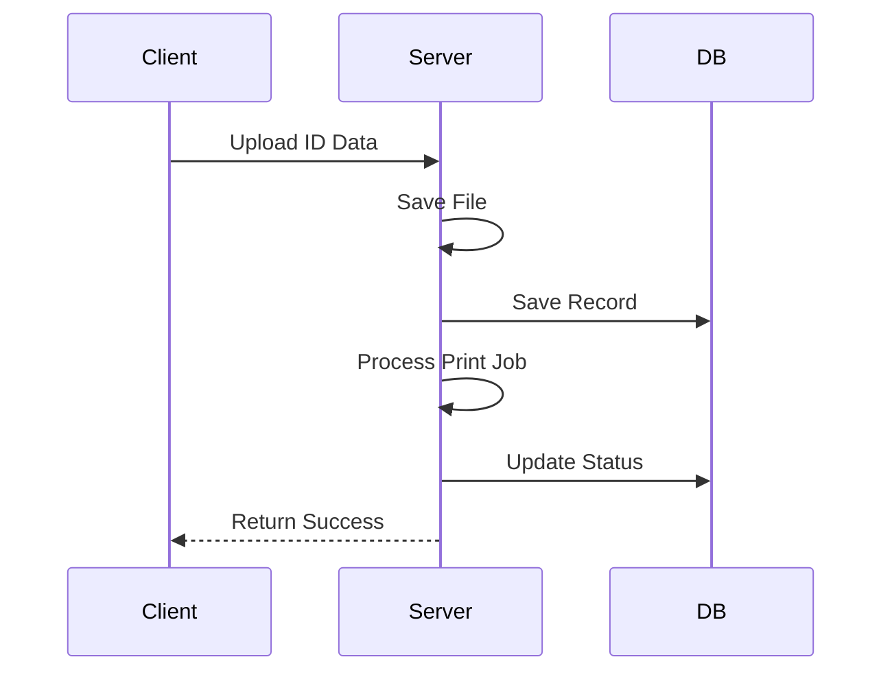

# Level 1 Architecture Diagram (50% Visibility)

## Core Components
1. **Frontend App**
2. **Backend Server**
3. **Database**

## Simplified Request Flow

```mermaid
sequenceDiagram
    participant Client
    participant Server
    participant DB

    Client->>Server: Upload ID Data
    Server->>Server: Save File
    Server->>DB: Save Record
    Server->>Server: Process Print Job
    Server->>DB: Update Status
    Server-->>Client: Return Success
```
