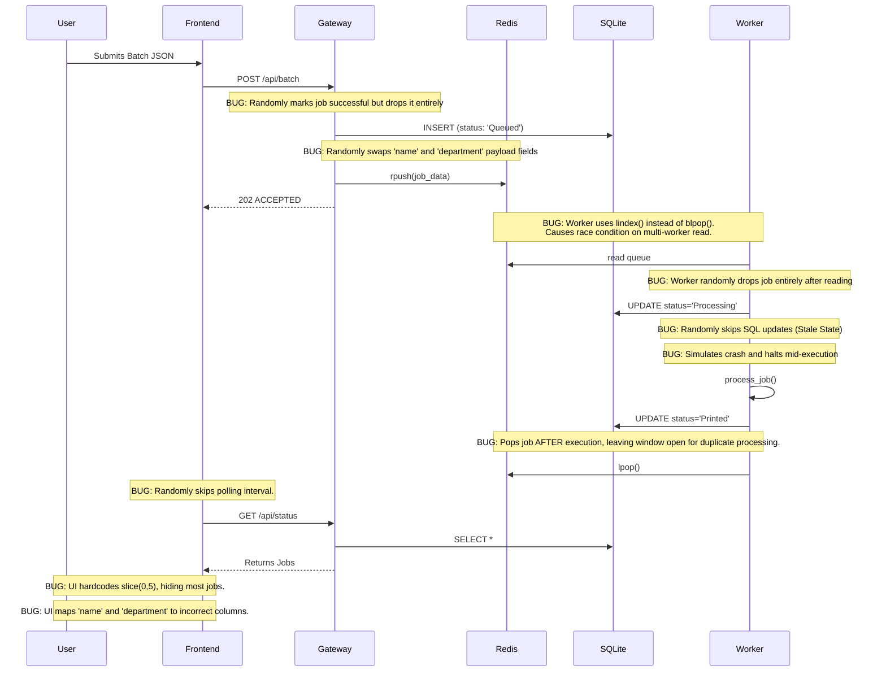

# Distributed Architecture Flow (100% Visibility)

## Core Distributed Components
1. **Frontend Dashboard**: React SPA with metrics and batch submission
2. **Gateway Service**: Flask API handling batch ingestion
3. **Message Broker**: Redis Queue
4. **Worker Service(s)**: Python workers for distributed processing
5. **Database**: Shared SQLite DB

## Request Lifecycle & Bug Intersections

