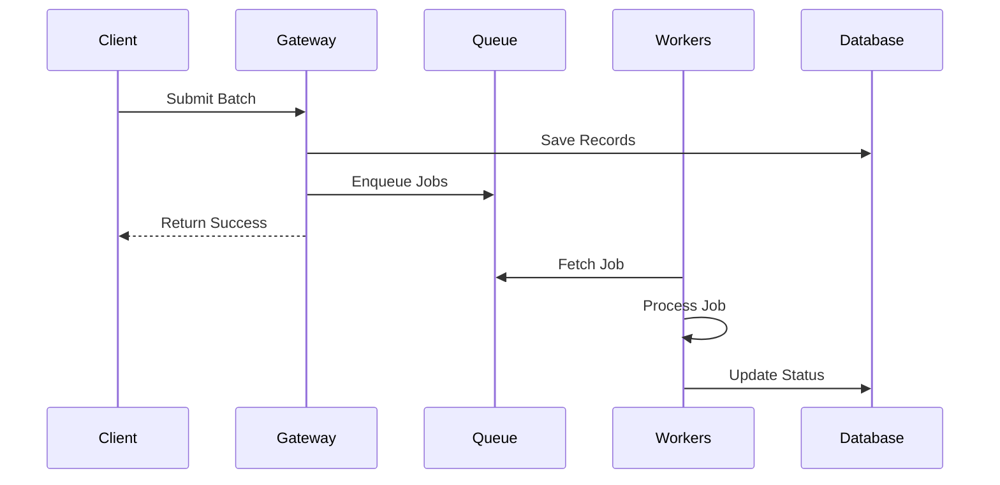

# Distributed Architecture Flow (50% Visibility)

## Core Components
1. **Frontend Dashboard**
2. **Gateway Service**
3. **Message Broker (Queue)**
4. **Worker Pool**
5. **Database**

## Simplified Request Flow

